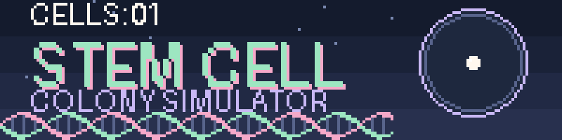

---

## About

[2-3 sentences: what the simulation shows, and why you built it.]

## What you can do

- [e.g. Adjust the division rate and watch the colony grow]
- [e.g. Change the proportion of cells that differentiate]
- [e.g. Reset and compare runs]

## The biology

| Term | Meaning here |
|---|---|
| [Self-renewal] | [How it is modelled] |
| [Differentiation] | [How it is modelled] |
| [Parameter] | [What it controls] |

## Run it

Open `index.html` in your browser. No installation needed.

## Roadmap

- [ ] [Idea 1]
- [ ] [Idea 2]

---

Made by [@KOUSHIKI1122](https://github.com/KOUSHIKI1122)

